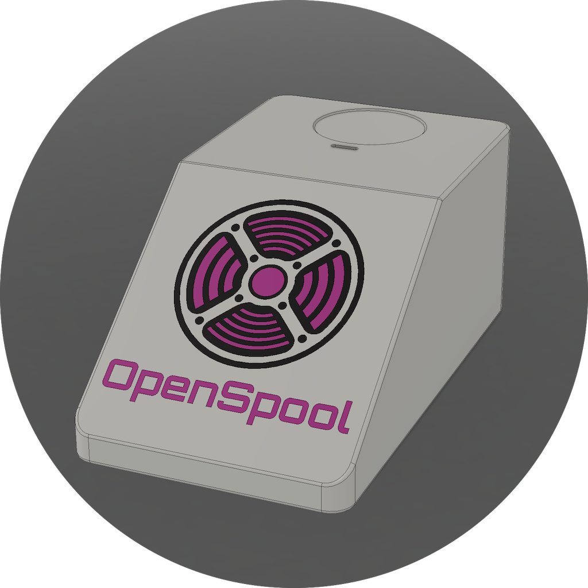

    

        
        <a href="{{ '/hardware/openspool-mini' | relative_url }}">
            <button type="button" name="button" class="btn">OpenSpool Mini</button>
        </a>
    

    

        
        <a href="{{ '/hardware/openspool-ams' | relative_url }}">
            <button type="button" name="button" class="btn">OpenSpool AMS</button>
        </a>
    

