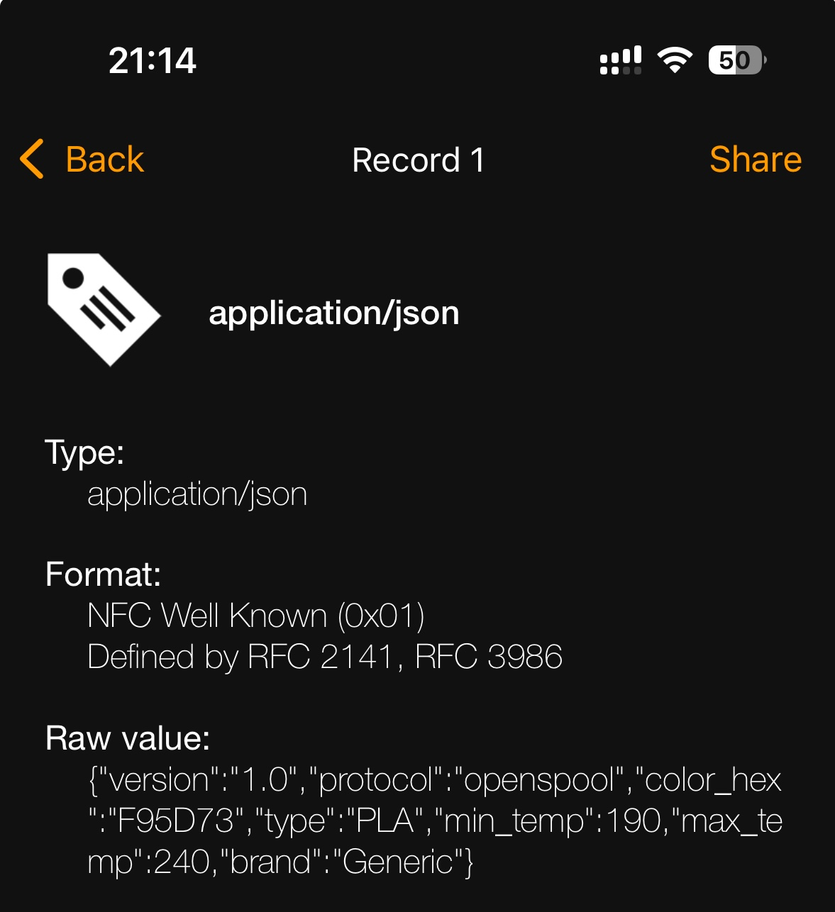

<p align=center>
    
</p>

# RFID Tags

At the heart of OpenSpool are the `NFC/RFID` tags that you will place on every spool you want to automate. The OpenSpool hardware works with a wide variety of High-Frequency tags (13.56Mhz)

{: .note-title }
> NFC vs RFID
> 
> `NFC` is to `RFID` like `Bluetooth` is to `Radio`.  
> All NFC Tags are RFID tags, but not all RFID tags are NFC tags. 

### Tag Selection

Purchase NTAG 215 or 216

[NTAG 215 - Amazon](https://a.co/d/5ojDUNk)  
[NTAG 215 - Aliexpress](https://www.aliexpress.us/item/3256806144939092.html)  

| Tag | Bytes | Supported |  
| --- | --- | --- |  
| NTAG 213 | 144 bytes | ❌ | 
| NTAG 215 | 504 bytes | ✅ |  
| NTAG 216 | 888 bytes | ✅ |   


## Protocol

OpenSpool NFC tags create an NDEF message on the tag. NDEF messages are human readable and can be viewed from your phone.

[iPhone - NFC Tools app](https://apps.apple.com/us/app/nfc-tools/id1252962749)  
[Android - NFC Tools app](https://www.google.com/url?sa=t&source=web&rct=j&opi=89978449&url=https://play.google.com/store/apps/details%3Fid%3Dcom.wakdev.wdnfc%26hl%3Den_US&ved=2ahUKEwicptyi7caJAxXomO4BHZo4FIgQFnoECAwQAQ&usg=AOvVaw0XjR90J9AV8I4375hycopuz)  

The NDEF message is a single record of type `application/json`

```json
{
    "protocol": "openspool",
    "version": "1.0",
    "type": "PLA",
    "color_hex": "FFAABB",
    "brand": "Generic",
    "min_temp": "220",
    "max_temp": "240"
}
```

`color_hex` = 6 digit hex color. For best results it needs to be one of [the predefined values](https://github.com/bambulab/BambuStudio/blob/733531b1c68e755da991c9503a09c2206c2e4984/src/slic3r/GUI/AMSMaterialsSetting.cpp#L1398-L1425) in bambu slicer.   
`type` = One of [the predfined values](https://github.com/bambulab/BambuStudio/blob/733531b1c68e755da991c9503a09c2206c2e4984/src/libslic3r/PrintConfig.cpp#L1577-L1609) in bambu slicer.  
`brand` = One of `Generic`, `Overture` `PolyLite`, `eSun`, `PolyTerra`. The full list can be found [in bambuslicer](https://github.com/bambulab/BambuStudio/tree/master/resources/profiles/BBL/filament). If a filament is defined that is not in this list, it will be assumed to be `Generic`.  


  